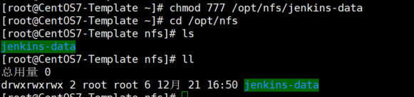

### NFS


```
#安装
yum install nfs-utils
systemctl start nfs
systemctl enable nfs
#复制代码创建共享目录，然后暴露出去：
mkdir -p /opt/nfs/jenkins-data
vi /etc/exports

/opt/nfs/jenkins-data 10.44.0.0/16(rw,all_squash)

# ip 使用 pod ip 范围（也可以用* 表示任何电脑都可以挂在！），后面的 all_squash 选项会将所有访问的用户都映射成 nfsnobody 用户，不管你是什么用户访问，最终都会压缩成 nfsnobody，所以你只要将 /opt/nfs/jenkins-data 的属主改为 nfsnobody，那么无论什么用户来访问都具有写权限。

chown -R nfsnobody. /opt/nfs/jenkins-data/
systemctl reload nfs
#复制代码然后在任意一个 node 节点上进行验证：
# showmount -e NFS_IP

```




