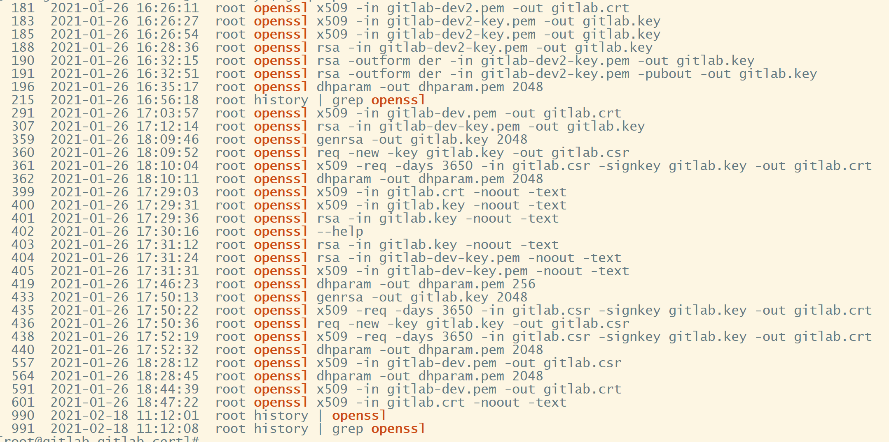

## Gitlab

#### 镜像

```
192.168.80.54:8081/library/gitlab/gitlab-ce:9.4.1-ce.1
```

#### 创建证书

```
kubectl create secret tls gitlab-tls-pem --cert=gitlab-server.pem --key=gitlab-server-key.pem -n gitlab-dev

kubectl -n gitlab-dev create secret generic gitlab-tls-pem --from-file=gitlab-server-key.pem --from-file=gitlab-server.pem

```

#### 部署secret

```
kind: Secret
apiVersion: v1
metadata:
  name: gitlab-postgresql
  namespace: gitlab-dev
  labels:
    app: gitlab-postgresql
    chart: postgresql-0.8.1
    heritage: Tiller
    release: gitlab
data:
  postgres-password: Z2l0bGFi
type: Opaque

---

kind: Secret
apiVersion: v1
metadata:
  name: gitlab-redis
  namespace: gitlab-dev
  labels:
    app: gitlab-redis
    chart: redis-0.9.0
    heritage: Tiller
    release: gitlab
data:
  redis-password: SzBVeHBDbWhEOA==
type: Opaque

---

kind: Secret
apiVersion: v1
metadata:
  name: gitlab-gitlab-ce
  namespace: gitlab-dev
  labels:
    app: gitlab-gitlab-ce
    chart: gitlab-ce-0.2.2
    heritage: Tiller
    release: gitlab
data:
  db-password: Z2l0bGFi
  db-user: Z2l0bGFi
  gitlab-root-password: MXFhekBXU1g=
type: Opaque
```

#### 部署pvc

```
kind: PersistentVolumeClaim
apiVersion: v1
metadata:
  name: gitlab-gitlab-ce-data
  namespace: gitlab-dev
spec:
  accessModes:
    - ReadWriteOnce
  resources:
    requests:
      storage: "50Gi"
  storageClassName: "nfs-client"
---
kind: PersistentVolumeClaim
apiVersion: v1
metadata:
  name: gitlab-gitlab-ce-etc
  namespace: gitlab-dev
spec:
  accessModes:
    - ReadWriteOnce
  resources:
    requests:
      storage: "50Gi"
  storageClassName: "nfs-client"
---
kind: PersistentVolumeClaim
apiVersion: v1
metadata:
  name: gitlab-postgresql
  namespace: gitlab-dev
  labels:
    app: gitlab-postgresql
    chart: postgresql-0.8.1
    heritage: Tiller
    release: gitlab
spec:
  accessModes:
    - ReadWriteOnce
  resources:
    requests:
      storage: "50Gi"
  storageClassName: "nfs-client"
---
kind: PersistentVolumeClaim
apiVersion: v1
metadata:
  name: gitlab-redis
  namespace: gitlab-dev
  labels:
    app: gitlab-redis
    chart: redis-0.9.0
    heritage: Tiller
    release: gitlab
spec:
  accessModes:
    - ReadWriteOnce
  resources:
    requests:
      storage: "50Gi"
  storageClassName: "nfs-client"
```

#### 部署configmap

```
kind: ConfigMap
apiVersion: v1
metadata:
  name: gitlab-gitlab-ce
  namespace: gitlab-dev
  labels:
    app: gitlab-gitlab-ce
    chart: gitlab-ce-0.2.2
    heritage: Tiller
    release: gitlab
data:
  gitlab_omnibus_config: >
    external_url ENV['EXTERNAL_URL'];

    root_pass = ENV['GITLAB_ROOT_PASSWORD'];

    gitlab_rails['initial_root_password'] = root_pass unless root_pass.to_s ==
    '';

    postgresql['enable'] = false;

    gitlab_rails['db_host'] = ENV['DB_HOST'];

    gitlab_rails['db_password'] = ENV['DB_PASSWORD'];

    gitlab_rails['db_username'] = ENV['DB_USER'];

    gitlab_rails['db_database'] = ENV['DB_DATABASE'];

    gitlab_rails['redis_host'] = ENV['REDIS_HOST'];

    gitlab_rails['redis_password'] = ENV['REDIS_PASSWORD'];

    unicorn['worker_processes'] = 2;

    manage_accounts['enable'] = true;

    manage_storage_directories['manage_etc'] = false;

    gitlab_shell['auth_file'] = '/gitlab-data/ssh/authorized_keys';

    git_data_dir '/gitlab-data/git-data';

    redis['enable'] = false; 

    gitlab_rails['shared_path'] = '/gitlab-data/shared';

    gitlab_rails['uploads_directory'] = '/gitlab-data/uploads';

    gitlab_ci['builds_directory'] = '/gitlab-data/builds';

    gitlab_rails['omniauth_enabled'] = true;

    gitlab_rails['omniauth_allow_single_sign_on'] = ['saml'];

    gitlab_rails['omniauth_block_auto_created_users'] = false;

    gitlab_rails['omniauth_auto_link_saml_user'] = true;

    nginx['redirect_http_to_https'] = true;

    nginx['ssl_certificate'] = "/etc/gitlab/ssl/gitlab-server.pem";

    nginx['ssl_certificate_key'] = "/etc/gitlab/ssl/gitlab-server-key.pem";
    gitlab_rails['omniauth_providers'] = [
      {
        name: 'saml',
        groups_attribute: 'Groups',
        required_groups: ['Admin'],
        args: {
                 assertion_consumer_service_url: 'http://gitlab.rdev.tech/users/auth/saml/callback',
                 idp_cert_fingerprint: '68:87:CF:A6:DF:9D:EB:06:77:50:87:7E:9E:5D:E3:09:C0:F0:70:7C',
                 idp_sso_target_url: 'http://gitlab.rdev.tech/auth/realms/demo/protocol/saml/clients/gitlab.rdev.tech',
                 issuer: 'gitlab.k8s-rf.io',
                 attribute_statements: {
                   first_name: ['first_name'],
                   last_name: ['last_name'],
                   name: ['name'],
                   username: ['name'],
                   email: ['email'] },
                 name_identifier_format: 'urn:oasis:names:tc:SAML:2.0:nameid-format:persistent'
               },
        label: 'Company Login' # optional label for SAML login button, defaults to "Saml"
      }
    ];
```

#### 部署svc

````
kind: Service
apiVersion: v1
metadata:
  name: gitlab-redis
  namespace: gitlab-dev
  labels:
    app: gitlab-redis
    chart: redis-0.9.0
    heritage: Tiller
    release: gitlab
spec:
  ports:
    - name: redis
      protocol: TCP
      port: 6379
      targetPort: redis
  selector:
    app: gitlab-redis
  type: ClusterIP
---

kind: Service
apiVersion: v1
metadata:
  name: gitlab-postgresql
  namespace: gitlab-dev
  labels:
    app: gitlab-postgresql
    chart: postgresql-0.8.1
    heritage: Tiller
    release: gitlab
spec:
  ports:
    - name: postgresql
      protocol: TCP
      port: 5432
      targetPort: postgresql
  selector:
    app: gitlab-postgresql
  type: ClusterIP
---
kind: Service
apiVersion: v1
metadata:
  name: gitlab-gitlab-ce
  namespace: gitlab-dev
  labels:
    app: gitlab-gitlab-ce
    chart: gitlab-ce-0.2.2
    heritage: Tiller
    release: gitlab
spec:
  ports:
    - name: ssh
      protocol: TCP
      port: 22
      targetPort: ssh
      nodePort: 31146
    - name: http
      protocol: TCP
      port: 80
      targetPort: http
      nodePort: 30864
    - name: https
      protocol: TCP
      port: 443
      targetPort: https
      nodePort: 30806
  selector:
    app: gitlab-gitlab-ce
  type: NodePort
  externalTrafficPolicy: Cluster
````

#### 部署deployment

```
kind: Deployment
apiVersion: apps/v1
metadata:
  name: gitlab-redis
  namespace: gitlab-dev
  labels:
    app: gitlab-redis
    chart: redis-0.9.0
    heritage: Tiller
    release: gitlab
  annotations:
    deployment.kubernetes.io/revision: '1'
spec:
  replicas: 1
  selector:
    matchLabels:
      app: gitlab-redis
  template:
    metadata:
      creationTimestamp: null
      labels:
        app: gitlab-redis
    spec:
      volumes:
        - name: redis-data
          persistentVolumeClaim:
            claimName: gitlab-redis
      containers:
        - name: gitlab-redis
          image: '192.168.80.54:8081/bitnami/redis:3.2.9-r2'
          ports:
            - name: redis
              containerPort: 6379
              protocol: TCP
          env:
            - name: REDIS_PASSWORD
              valueFrom:
                secretKeyRef:
                  name: gitlab-redis
                  key: redis-password
          resources:
            requests:
              cpu: 100m
              memory: 1Gi
          volumeMounts:
            - name: redis-data
              mountPath: /bitnami/redis
          livenessProbe:
            exec:
              command:
                - redis-cli
                - ping
            initialDelaySeconds: 30
            timeoutSeconds: 5
            periodSeconds: 10
            successThreshold: 1
            failureThreshold: 3
          readinessProbe:
            exec:
              command:
                - redis-cli
                - ping
            initialDelaySeconds: 5
            timeoutSeconds: 1
            periodSeconds: 10
            successThreshold: 1
            failureThreshold: 3
          terminationMessagePath: /dev/termination-log
          terminationMessagePolicy: File
          imagePullPolicy: IfNotPresent
      restartPolicy: Always
      terminationGracePeriodSeconds: 30
      dnsPolicy: ClusterFirst
      securityContext: {}
      schedulerName: default-scheduler
  strategy:
    type: RollingUpdate
    rollingUpdate:
      maxUnavailable: 1
      maxSurge: 1
  revisionHistoryLimit: 2147483647
  progressDeadlineSeconds: 2147483647
---
kind: Deployment
apiVersion: apps/v1
metadata:
  name: gitlab-postgresql
  namespace: gitlab-dev
  labels:
    app: gitlab-postgresql
    chart: postgresql-0.8.1
    heritage: Tiller
    release: gitlab
  annotations:
    deployment.kubernetes.io/revision: '1'
spec:
  replicas: 1
  selector:
    matchLabels:
      app: gitlab-postgresql
  template:
    metadata:
      creationTimestamp: null
      labels:
        app: gitlab-postgresql
    spec:
      volumes:
        - name: data
          persistentVolumeClaim:
            claimName: gitlab-postgresql
      containers:
        - name: gitlab-postgresql
          image: '192.168.80.54:8081/library/postgres:9.6'
          ports:
            - name: postgresql
              containerPort: 5432
              protocol: TCP
          env:
            - name: POSTGRES_USER
              value: gitlab
            - name: PGUSER
              value: gitlab
            - name: POSTGRES_DB
              value: gitlab
            - name: POSTGRES_INITDB_ARGS
            - name: PGDATA
              value: /var/lib/postgresql/data/pgdata
            - name: POSTGRES_PASSWORD
              valueFrom:
                secretKeyRef:
                  name: gitlab-postgresql
                  key: postgres-password
            - name: POD_IP
              valueFrom:
                fieldRef:
                  apiVersion: v1
                  fieldPath: status.podIP
          resources:
            requests:
              cpu: 100m
              memory: 256Mi
          volumeMounts:
            - name: data
              mountPath: /var/lib/postgresql/data/pgdata
              subPath: postgresql-db
          livenessProbe:
            exec:
              command:
                - sh
                - '-c'
                - exec pg_isready --host $POD_IP
            initialDelaySeconds: 60
            timeoutSeconds: 5
            periodSeconds: 10
            successThreshold: 1
            failureThreshold: 6
          readinessProbe:
            exec:
              command:
                - sh
                - '-c'
                - exec pg_isready --host $POD_IP
            initialDelaySeconds: 5
            timeoutSeconds: 3
            periodSeconds: 5
            successThreshold: 1
            failureThreshold: 3
          terminationMessagePath: /dev/termination-log
          terminationMessagePolicy: File
          imagePullPolicy: IfNotPresent
      restartPolicy: Always
      terminationGracePeriodSeconds: 30
      dnsPolicy: ClusterFirst
      securityContext: {}
      schedulerName: default-scheduler
  strategy:
    type: RollingUpdate
    rollingUpdate:
      maxUnavailable: 1
      maxSurge: 1
  revisionHistoryLimit: 2147483647
  progressDeadlineSeconds: 2147483647
---
kind: Deployment
apiVersion: apps/v1
metadata:
  name: gitlab-gitlab-ce
  namespace: gitlab-dev
  labels:
    app: gitlab-gitlab-ce
    chart: gitlab-ce-0.2.2
    heritage: Tiller
    release: gitlab
  annotations:
    deployment.kubernetes.io/revision: '27'
spec:
  replicas: 1
  selector:
    matchLabels:
      app: gitlab-gitlab-ce
  template:
    metadata:
      creationTimestamp: null
      labels:
        app: gitlab-gitlab-ce
      annotations:
        kubesphere.io/restartedAt: '2020-12-15T06:29:23.558Z'
        logging.kubesphere.io/logsidecar-config: '{}'
    spec:
      volumes:
        - name: gitlab-etc
          persistentVolumeClaim:
            claimName: gitlab-gitlab-ce-etc
        - name: gitlab-data
          persistentVolumeClaim:
            claimName: gitlab-gitlab-ce-data
        - name: volume-u9gjxx
          secret:
            secretName: gitlab-tls-pem
            defaultMode: 420
      containers:
        - name: gitlab-gitlab-ce
          image: '192.168.80.54:8081/library/gitlab/gitlab-ce:9.4.1-ce.1'
          ports:
            - name: ssh
              containerPort: 22
              protocol: TCP
            - name: http
              containerPort: 80
              protocol: TCP
            - name: https
              containerPort: 443
              protocol: TCP
          env:
            - name: GITLAB_OMNIBUS_CONFIG
              valueFrom:
                configMapKeyRef:
                  name: gitlab-gitlab-ce
                  key: gitlab_omnibus_config
            - name: GITLAB_ROOT_PASSWORD
              valueFrom:
                secretKeyRef:
                  name: gitlab-gitlab-ce
                  key: gitlab-root-password
            - name: EXTERNAL_URL
              value: 'https://gitlab.rdev.tech/'
            - name: DB_HOST
              value: gitlab-postgresql.gitlab-dev
            - name: DB_USER
              valueFrom:
                secretKeyRef:
                  name: gitlab-gitlab-ce
                  key: db-user
            - name: DB_PASSWORD
              valueFrom:
                secretKeyRef:
                  name: gitlab-gitlab-ce
                  key: db-password
            - name: DB_DATABASE
              value: gitlab
            - name: REDIS_HOST
              value: gitlab-redis.gitlab-dev
            - name: REDIS_PASSWORD
              valueFrom:
                secretKeyRef:
                  name: gitlab-redis
                  key: redis-password
          resources: {}
          volumeMounts:
            - name: gitlab-etc
              mountPath: /etc/gitlab
            - name: gitlab-data
              mountPath: /gitlab-data
            - name: volume-u9gjxx
              mountPath: /etc/gitlab/ssl
          livenessProbe:
            httpGet:
              path: /help
              port: http
              scheme: HTTP
            initialDelaySeconds: 200
            timeoutSeconds: 1
            periodSeconds: 10
            successThreshold: 1
            failureThreshold: 10
          readinessProbe:
            httpGet:
              path: /help
              port: http
              scheme: HTTP
            initialDelaySeconds: 120
            timeoutSeconds: 1
            periodSeconds: 10
            successThreshold: 1
            failureThreshold: 3
          terminationMessagePath: /dev/termination-log
          terminationMessagePolicy: File
          imagePullPolicy: Always
          securityContext:
            privileged: true
      restartPolicy: Always
      terminationGracePeriodSeconds: 30
      dnsPolicy: ClusterFirst
      securityContext: {}
      schedulerName: default-scheduler
  strategy:
    type: RollingUpdate
    rollingUpdate:
      maxUnavailable: 1
      maxSurge: 1
  revisionHistoryLimit: 2147483647
  progressDeadlineSeconds: 2147483647
```

#### 部署ingress

```
kind: Ingress
apiVersion: extensions/v1beta1
metadata:
  name: gitlab
  namespace: gitlab-dev
  labels:
    app: gitlab
  annotations:
    nginx.ingress.kubernetes.io/backend-protocol: "HTTPS"
    nginx.ingress.kubernetes.io/secure-backends: 'true'
    nginx.ingress.kubernetes.io/ssl-passthrough: 'true'
spec:
  rules:
    - host: gitlab.rdev.tech
      http:
        paths:
          - path: /
            backend:
              serviceName: gitlab-gitlab-ce
              servicePort: 443
  tls:
  - hosts:
    - gitlab.rdev.tech
    secretName: gitlab-tls-pem

```

#### gitlab对接keycloak


```
(
    echo "-----BEGIN CERTIFICATE-----"
    grep -oP '<ds:X509Certificate>(.*)</ds:X509Certificate>' "descriptor2.xml" | sed -r -e 's~<[/]?ds:X509Certificate>~~g' | fold -w 64
    echo "-----END CERTIFICATE-----"
) | openssl x509 -noout -fingerprint -sha1
```

```
# configmap添加
```

```
    gitlab_rails['omniauth_providers'] = [
      {
        name: 'saml',
        groups_attribute: 'Groups',
        required_groups: ['Admin'],
        args: {
                 assertion_consumer_service_url: 'http://gitlab.rdev.tech/users/auth/saml/callback',
                 idp_cert_fingerprint: '68:87:CF:A6:DF:9D:EB:06:77:50:87:7E:9E:5D:E3:09:C0:F0:70:7C',
                 idp_sso_target_url: 'http://gitlab.rdev.tech/auth/realms/demo/protocol/saml/clients/gitlab.rdev.tech',
                 issuer: 'gitlab.k8s-rf.io',
                 attribute_statements: {
                   first_name: ['first_name'],
                   last_name: ['last_name'],
                   name: ['name'],
                   username: ['name'],
                   email: ['email'] },
                 name_identifier_format: 'urn:oasis:names:tc:SAML:2.0:nameid-format:persistent'
               },
        label: 'Company Login' # optional label for SAML login button, defaults to "Saml"
      }
    ];
```

