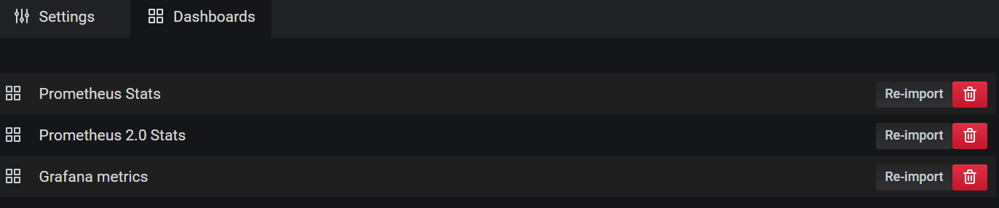
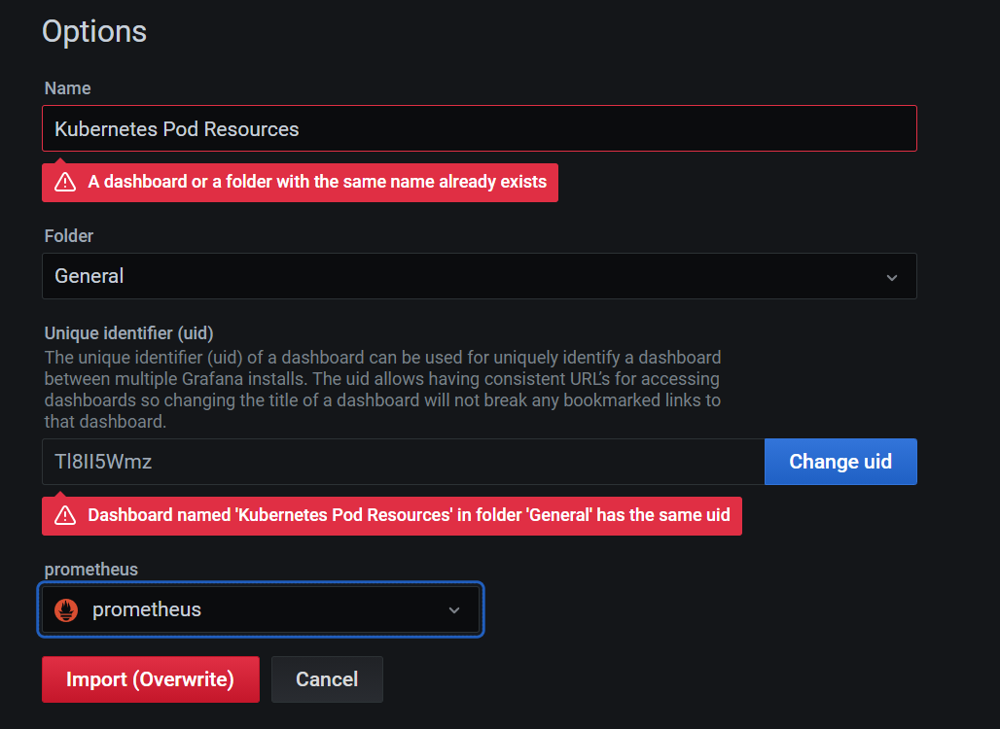
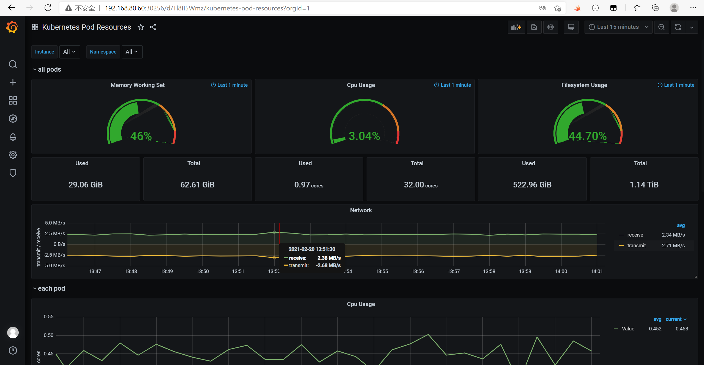

> 1.  apply yaml
>
>    ```
>    kubectl create -f manifests/setup -f manifests
>    ```

> 2. configuration->data resource->prometheus->dashboards->import
>
>    

> 3. create->import->upload json file,select Kubernetes Pod Resources.json, ->mport
>
>    

> 4. View
>
>    


## Custom metrics

### ETCD

> 1. 查看etcd证书
>
>    ```shell
>    (base) -bash-4.2# cat /etc/etcd.env
>    # Environment file for etcd v3.4.13
>    ETCD_DATA_DIR=/var/lib/etcd
>    ETCD_ADVERTISE_CLIENT_URLS=https://192.168.80.60:2379
>    ETCD_INITIAL_ADVERTISE_PEER_URLS=https://192.168.80.60:2380
>    ETCD_INITIAL_CLUSTER_STATE=existing
>    ETCD_METRICS=basic
>    ETCD_LISTEN_CLIENT_URLS=https://192.168.80.60:2379,https://127.0.0.1:2379
>    ETCD_ELECTION_TIMEOUT=5000
>    ETCD_HEARTBEAT_INTERVAL=250
>    ETCD_INITIAL_CLUSTER_TOKEN=k8s_etcd
>    ETCD_LISTEN_PEER_URLS=https://192.168.80.60:2380
>    ETCD_NAME=etcd1
>    ETCD_PROXY=off
>    ETCD_INITIAL_CLUSTER=etcd1=https://192.168.80.60:2380,etcd2=https://192.168.80.61:2380,etcd3=https://192.168.81.116:2380
>    ETCD_AUTO_COMPACTION_RETENTION=8
>    ETCD_SNAPSHOT_COUNT=10000
>    # Flannel need etcd v2 API
>    ETCD_ENABLE_V2=true
>    
>    # TLS settings
>    ETCD_TRUSTED_CA_FILE=/etc/ssl/etcd/ssl/ca.pem
>    ETCD_CERT_FILE=/etc/ssl/etcd/ssl/member-node1.pem
>    ETCD_KEY_FILE=/etc/ssl/etcd/ssl/member-node1-key.pem
>    ETCD_CLIENT_CERT_AUTH=true
>    
>    ETCD_PEER_TRUSTED_CA_FILE=/etc/ssl/etcd/ssl/ca.pem
>    ETCD_PEER_CERT_FILE=/etc/ssl/etcd/ssl/member-node1.pem
>    ETCD_PEER_KEY_FILE=/etc/ssl/etcd/ssl/member-node1-key.pem
>    ETCD_PEER_CLIENT_CERT_AUTH=True
>    
>    
>    
>    
>    # CLI settings
>    ETCDCTL_ENDPOINTS=https://127.0.0.1:2379
>    ETCDCTL_CACERT=/etc/ssl/etcd/ssl/ca.pem
>    ETCDCTL_KEY=/etc/ssl/etcd/ssl/admin-node1-key.pem
>    ETCDCTL_CERT=/etc/ssl/etcd/ssl/admin-node1.pem
>    ```

> 2. 创建Secret对象
>
>    ```
>    kubectl -n monitoring create secret generic etcd-certs \
>    --from-file=/etc/ssl/etcd/ssl/member-node1.pem \
>    --from-file=/etc/ssl/etcd/ssl/member-node1-key.pem \
>    --from-file=/etc/ssl/etcd/ssl/ca.pem 
>    ```

> 3. 将创建etcd-certs对象配置到prometheus资源对象中
>
>    ```
>    kubectl edit prometheus k8s -n monitoring
>    ```
>
>    ```
>      nodeSelector:
>        kubernetes.io/os: linux
>      podMonitorSelector: {}
>      replicas: 2
>      # 添加如下两行
>      secrets:
>      - etcd-certs
>    ```
>
>    ```
>    kubectl exec -it prometheus-k8s-0 /bin/sh -n monitoring
>    ```
>
>    ```
>    ls /etc/prometheus/secrets/etcd-certs/
>    ```

> 4. 创建ServiceMonitor
>
>    ```yaml
>    # prometheus-etcdServiceMonitor.yaml
>    apiVersion: monitoring.coreos.com/v1
>    kind: ServiceMonitor
>    metadata:
>      labels:
>        k8s-app: etcd-k8s
>      name: etcd-k8s
>      namespace: monitoring
>    spec:
>      endpoints:
>      - port: port
>        interval: 30s
>        scheme: https
>        tlsConfig:
>          caFile: /etc/prometheus/secrets/etcd-certs/ca.crt
>          certFile: /etc/prometheus/secrets/etcd-certs/healthcheck-client.crt
>          keyFile: /etc/prometheus/secrets/etcd-certs/healthcheck-client.key
>          insecureSkipVerify: true
>      jobLabel: k8s-app
>      namespaceSelector:
>        matchNames:
>        - kube-system
>      selector:
>        matchLabels:
>          k8s-app: etcd
>    ```
>
>    ```
>    kubectl apply -f prometheus-etcdServiceMonitor.yaml
>    ```

> 5. 创建Service
>
>    ```
>    # vim prometheus-etcdService.yaml
>    apiVersion: v1
>    kind: Service
>    metadata:
>      labels:
>        k8s-app: etcd
>      name: etcd-k8s
>      namespace: kube-system
>    spec:
>      ports:
>      - name: port
>        port: 2379
>        protocol: TCP
>      type: ClusterIP
>      clusterIP: None
>    ---
>    apiVersion: v1
>    kind: Endpoints
>    metadata:
>      name: etcd-k8s
>      namespace: kube-system
>      labels:
>        k8s-app: etcd
>    subsets:
>    - addresses:
>      - ip: 192.168.229.134
>        nodeName: etcd-master
>    #  - ip: 192.168.229.135
>    #    nodeName: etcd02
>    #  - ip: 192.168.229.136
>    #    nodeName: etcd03
>      ports:
>      - name: port
>        port: 2379
>        protocol: TCP
>    ```

