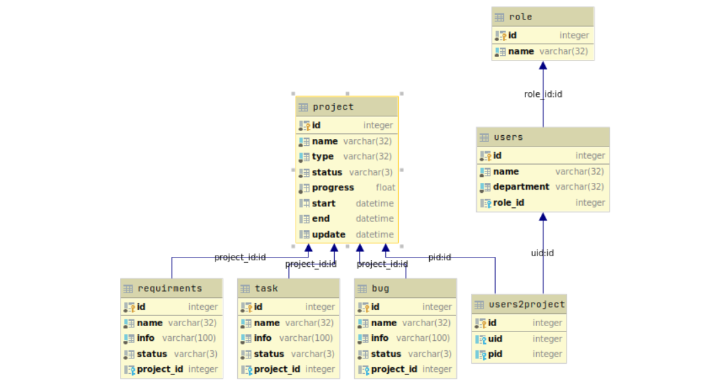

```
GET /projects # 项目总览
```

| 字段           | 接口                                        | 来源    |
| -------------- | ------------------------------------------- | ------- |
| id             |                                             |         |
| project_name   | GET /projects.json                          | redmine |
| project_type   |                                             |         |
| department     |                                             |         |
| project_leader | GET projects/[:projectid:]/memberships.json | redmine |
| bugs           | GET /projects/[:projectid:]/issues.json     | redmine |
| tasks          | GET /projects/[:projectid:]/issues.json     | redmine |
| bug_closed     | GET /projects/[:projectid:]/issues.json     | redmine |
| task_closed    | GET /projects/[:projectid:]/issues.json     | redmine |
| start_time     |                                             |         |
| end_time       |                                             |         |
| status         |                                             |         |
| progress       |                                             |         |

```
GET /memberships # 团队总览
```

| 字段           | 接口                                         | 来源    |
| -------------- | -------------------------------------------- | ------- |
| project_name   | GET /projects.json                           | redmine |
| member_count   | GET /projects/[:projectid:]/memberships.json | redmine |
| developer      | GET /projects/[:projectid:]/memberships.json | redmine |
| tester         | GET /projects/[:projectid:]/memberships.json | redmine |
| project_leader | GET projects/[:projectid:].json              | redmine |

```
GET /efficiencies # 效率总览
```

| 字段         | 接口                                         | 来源    |
| ------------ | -------------------------------------------- | ------- |
| project_name | GET /projects.json                           | redmine |
| commits      | GET /projects/[:projectid:]/memberships.json | redmine |
| depoyment    | GET /job/[:projectid:]/api/json              | jenkins |

```
GET /projects/[:projectid:] # 项目详情
```

| 字段                | 接口                                                         | 来源      |
| ------------------- | ------------------------------------------------------------ | --------- |
| id                  |                                                              | projectid |
| project_name        | GET /projects.json                                           | redmine   |
| project_info        | GET projects/[:projectid:].json                              | redmine   |
| project_leader      | GET projects/[:projectid:].json                              | redmine   |
| members             | GET /projects/[:projectid:]/memberships.json                 | redmine   |
| requirements        | GET /projects/[:projectid:]/issues.json                      | redmine   |
| requirements_closed | GET /projects/[:projectid:]/issues.json                      | redmine   |
| tasks               | GET /projects/[:projectid:]/issues.json                      | redmine   |
| tasks_closed        | GET /projects/[:projectid:]/issues.json                      | redmine   |
| bugs                | GET /projects/[:projectid:]/issues.json                      | redmine   |
| bugs_closed         | GET /projects/[:projectid:]/issues.json                      | redmine   |
| project_tracking    | https://redmine-dev.rdev.tech/projects/chuanzang             | redmine   |
| sonarqube           |                                                              |           |
| k8s                 | python kubernetes库                                          |           |
| repository          | https://gitlab-dev2.rdev.tech/[:group_name:]/[:project_name:] | gitlab    |
| harbor              |                                                              |           |
| workflow            | GET /job/[:projectid:]/api/json?pretty=true                  | jenkins   |

```
GET /projects/progress # 进度分析
```

| 字段              | 接口                                    | 来源    |
| ----------------- | --------------------------------------- | ------- |
| project_name      | GET /projects.json                      | redmine |
| requirements      | GET /projects/[:projectid:]/issues.json | redmine |
| requirements_open | requirements - requirements_closed      | redmine |
| tasks             | GET /projects/[:projectid:]/issues.json | redmine |
| tasks_open        | tasks - tasks_closed                    | redmine |
| progress          | tasks_closed/tasks                      |         |
| start_time        |                                         |         |
| end_time          |                                         |         |

```
GET /projects/bugs # 缺陷分析
```

| 字段                | 接口                                    | 来源    |
| ------------------- | --------------------------------------- | ------- |
| project_name        | GET /projects.json                      | redmine |
| requirements        | GET /projects/[:projectid:]/issues.json | redmine |
| requirements_closed | GET /projects/[:projectid:]/issues.json | redmine |
| tasks               | GET /projects/[:projectid:]/issues.json | redmine |
| tasks_closed        | GET /projects/[:projectid:]/issues.json | redmine |
| tasks_critical      | GET /projects/[:projectid:]/issues.json | redmine |
| start_time          |                                         |         |
| end_time            |                                         |         |

```
GET /projects/coasted #投入分析
```

| 字段         | 接口                                    | 来源    |
| ------------ | --------------------------------------- | ------- |
| username     | GET /projects.json                      | redmine |
| project_name | GET /projects.json                      | redmine |
| tasks        | GET /projects/[:projectid:]/issues.json | redmine |
| tasks_open   | tasks - tasks_closed                    | redmine |
| workload     |                                         |         |
| start_time   |                                         |         |
| end_time     |                                         |         |

